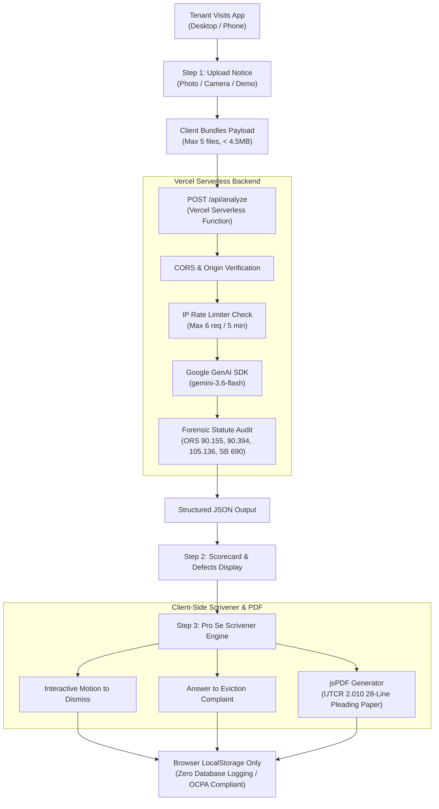

# Standard Operating Procedure (SOP) & Technical Architecture Document
**Project**: Oregon Tenant Guard (`Oregon-Tenant-guard-`)  
**Repository**: [https://github.com/RanThaMan88/Oregon-Tenant-guard-](https://github.com/RanThaMan88/Oregon-Tenant-guard-)  
**Production URL**: [https://oregontenantguard.vercel.app](https://oregontenantguard.vercel.app)  
**Target Environment**: Vercel (Node.js Serverless + Vite SPA)  
**Last Updated**: September 2026  
**Document Version**: 2.0.0  

---

## 🎯 Executive Summary & Purpose
**Oregon Tenant Guard** is an automated computational document preparation and forensic audit software (Pro Se Scrivener) designed for self-represented tenants facing residential eviction in Oregon Circuit Courts.

The software analyzes eviction termination notices under:
- **ORS Chapter 90**: Residential Landlord and Tenant Act (RLTA)
- **ORS Chapter 105**: Forcible Entry and Detainer (FED) actions
- **ORS 9.160 & 9.320**: Non-attorney pro se computational scrivener rules
- **UTCR 2.010**: Uniform Trial Court Rules (28-line numbered pleading format)
- **SB 690 (2026)**: Mandatory 90-day eviction stay for qualifying perinatal/OHP households
- **Oregon Consumer Privacy Act (OCPA)**: Client-side zero-knowledge privacy architecture

This document serves as the master SOP for any developer, AI assistant (including Google Gemini), or collaborator working on this codebase.

---

## 🛠️ Part 1: What We Built & Accomplished

### 1.1. Serverless Backend & AI Upgrade
- **Vercel Serverless Function (`/api/analyze.ts`)**: Built a secure server-side Node.js function that handles notice parsing and communication with Google Gemini API.
- **Model Upgrade to `gemini-3.6-flash`**: Upgraded from the deprecated `gemini-2.5-flash` model to Google's official `gemini-3.6-flash` Interactions model with structured JSON response schema enforcement.
- **Deterministic Math Engine Fallback**: If an API quota or network error occurs, the frontend automatically falls back to an offline regex and calendar computation engine in `src/services/geminiService.ts`, ensuring the user never sees a broken screen.

### 1.2. Multi-Layered Security Hardening
- **Zero Client-Side Key Leaks**: Removed all `VITE_GEMINI_API_KEY` vectors. Secrets live strictly on Vercel's backend environment and cannot be inspected in browser bundles.
- **IP Sliding-Window Rate Limiter**: Added an in-memory rate limiter in `api/analyze.ts` restricting requests to **6 document audits per 5 minutes per IP**. Verified live with HTTP `429 Too Many Requests`.
- **CORS & Origin Locking**: Configured CORS to restrict API execution strictly to approved domains (`localhost`, `*.vercel.app`, and production domains).
- **Payload & Timeout Safeguards**:
  - Enforced a maximum of 5 pages/documents per request.
  - Enforced a 4.5MB request payload cap to prevent serverless memory crashes.
  - Configured `maxDuration: 30` in `vercel.json` to prevent serverless timeouts during multi-page OCR.

### 1.3. Institutional Legal-Tech Footer & Compliance
- Added an institutional 4-column footer featuring:
  - **Direct Document Shortcuts**: Motion to Dismiss (ORS 90.155), FED Answer (ORS 90.320), SB 690 Stay Motion, Fee Waiver Form (ORS 21.682), Record Sealing (ORS 105.163).
  - **Legal Policies Modals**: Terms of Service, Privacy Policy (OCPA), UPL Scrivener Rules (ORS 9.160), and Gemini AI Transparency Export.
  - **Official Oregon Legal Aid & Crisis Lines**: 988 Suicide & Crisis Lifeline, Oregon 211 Housing, Oregon State Bar Modest Means (`(503) 684-3763`), Legal Aid Services of Oregon (`lasoregon.org`), and Oregon Law Center (`oregonlawcenter.org`).
  - **Statutory Disclaimers**: Formally certified compliance with ORS 9.160 / 9.320, ORCP 17 (factual verification), and ORS 646.608 (no outcome guarantee).

---

## 🔌 Part 2: What is Connected & Configured in This IDE

### 2.1. Git & Version Control
- **Remote Origin**: `https://github.com/RanThaMan88/Oregon-Tenant-guard-.git`
- **Active Branch**: `main`
- **Authentication**: Local Git Credential Manager is fully authenticated. Commits can be pushed directly without credentials prompts.
- **Auto-Sync Script**: `sync-github.bat` in the project root allows 1-click bundle generation and Git push.

### 2.2. Vercel Cloud Connection
- **Organization / Team**: `randy-corbett-s-projects`
- **Project Name**: `oregon_tenant_guard`
- **Local Link**: Local repository is linked via Vercel CLI (`.vercel` project config).
- **GitHub Webhook Integration**: Pushing any commit to `origin main` automatically triggers a zero-downtime production deployment on Vercel (~18 seconds build time).
- **Configured Vercel Environment Variables**:
  - `GEMINI_API_KEY`: Google Gemini API key (Type: Secret, Environments: Production, Preview).
  - `APP_URL`: Production URL (Type: Secret, Environments: Production, Preview).

### 2.3. Model Context Protocol (MCP) Servers Configured
In `c:\Users\Randy\.gemini\config\mcp_config.json` and VS Code's `mcp.json`:
- **`vercel`**: Uses `@vineethnkrishnan/vercel-mcp` with authenticated user token `vcp_6Kzl...` for deployment inspection and project management.
- **`github-mcp-server`**: Docker-based GitHub MCP for repository and PR automation.
- **`cloudrun`**: Google Cloud Run MCP (`@google-cloud/cloud-run-mcp`).
- **`datacloud_*`**: Suite of Google Cloud tools (BigQuery, Cloud SQL, AlloyDB, GCS, Spanner).
- **`notebooks` & `visualization`**: Data analysis and interactive charting servers.

---

## ⚙️ Part 3: How the Application Functions



### 3.1. Architectural Flow Details
1. **Notice Ingestion**: Accepts images (PNG, JPEG, WEBP) or raw text. Features a live camera viewfinder with alignment box.
2. **Backend Forensic Parsing**:
   - Computes notice date vs. landlord deadline.
   - Enforces the 13-day rule for first-class mail service under ORS 90.155.
   - Audits rent cure demands under ORS 90.394 to detect improper late fees, utility surcharges, or pet penalties.
   - Checks for mandatory 2026 multilingual rights advisory under ORS 105.136.
   - Evaluates retaliation protection if the tenant submitted habitability complaints within 6 months (ORS 90.385).
3. **Pleading Generation (`src/services/pdfService.ts`)**: Generates print-ready PDFs formatted according to Oregon Uniform Trial Court Rule (UTCR) 2.010 with formal line numbering (1–28), caption block, statement of facts, prayer for relief, and certificate of service.
4. **Data Persistence**: 100% client-side zero-knowledge. Notice scans and case facts are saved only in the visitor's browser `localStorage` (`tenant_guard_cases`). No central database logs sensitive tenant PII.

---

## 🚧 Part 4: What is NOT Configured Yet (Roadmap & Backlog)

For future development or commercial scaling, the following items are currently **simulated or pending configuration**:

### 4.1. Real Payment Gateway (Stripe Backend)
- **Current State**: The app features a simulated checkout modal (`handleSimulatedStripePayment` in `src/App.tsx`). When users click "Pay with Stripe", it simulates a successful payment after a 1.2-second delay to test conversion demand.
- **What is needed to activate**:
  1. A Vercel Serverless Function `/api/checkout.ts` using `stripe` Node SDK.
  2. Stripe API keys (`STRIPE_SECRET_KEY` and `STRIPE_WEBHOOK_SECRET`) added to Vercel Environment Variables.
  3. Real webhook handler to unlock PDF generation after card verification.

### 4.2. Automated Transactional Email Backend (Resend)
- **Current State**: The "Email Court Pack" feature opens a modal and currently triggers client-side mailto / mock delivery.
- **What is needed to activate**:
  1. A Vercel Serverless Function `/api/send-pack.ts` using the Resend SDK (`npm install resend`).
  2. A verified sending domain (e.g., `mail.oregontenantguard.org`) and `RESEND_API_KEY`.
  3. Attaching the generated PDF directly to the outgoing email.

### 4.3. Cloud Database & User Accounts (Supabase)
- **Current State**: Client uses local browser storage. `@supabase/supabase-js` is installed in `package.json` and a placeholder client exists in `src/services/supabaseClient.ts`, but it is not connected to active UI flows.
- **What is needed to activate**:
  1. Create a Supabase project at [supabase.com](https://supabase.com).
  2. Create tables for `waitlist_leads` or `tenant_cases` with Row-Level Security (RLS).
  3. Add `VITE_SUPABASE_URL` and `VITE_SUPABASE_ANON_KEY` to environment settings.

### 4.4. Custom Domain & DNS
- **Current State**: Operating on default Vercel subdomain: `https://oregontenantguard.vercel.app`.
- **What is needed to activate**:
  1. Purchase a custom domain (e.g., `oregontenantguard.org` or `oregontenantguard.com`).
  2. In Vercel Project Settings > Domains, add the domain and point DNS records (CNAME / A record).

### 4.5. Production Conversion Analytics
- **Current State**: No tracking cookies or analytics scripts are loaded (maximizing privacy compliance).
- **What is needed for demand testing**:
  - Add privacy-focused analytics (Vercel Web Analytics or PostHog) to monitor the exact funnel: *Visits* $\rightarrow$ *Audits Completed* $\rightarrow$ *Checkout Clicks*.

---

## 📋 Part 5: Operating Guidelines for AI Agents & Developers

When making future edits to this project, follow these mandatory rules:

1. **Never Expose API Keys on Frontend**:
   - **Never** add `VITE_GEMINI_API_KEY` or put secrets in files under `src/`.
   - All AI calls must go through `/api/analyze` or a serverless route where keys reside in `process.env.GEMINI_API_KEY`.
2. **Preserve Pro Se Scrivener Legal Framing**:
   - Never use language implying legal representation, attorney services, or guaranteed court outcomes.
   - Always adhere to ORS 9.160 / ORS 9.320 / ORS 646.608 disclaimers.
3. **UTCR 2.010 Pleading Integrity**:
   - Any modifications to generated court documents must preserve 28-line numbered pleading formatting, signature lines, and certificate of service blocks.
4. **Build & Type Check Before Pushing**:
   - Always run `npx tsc --noEmit` and `npm run build` locally before pushing to `main`.
5. **Deployment Command**:
   - To deploy updates to production, simply commit and push to branch `main`:
     ```bash
     git add .
     git commit -m "your update message"
     git push origin main
     ```
   - Vercel will automatically trigger, build, and deploy the update live within 20 seconds.
